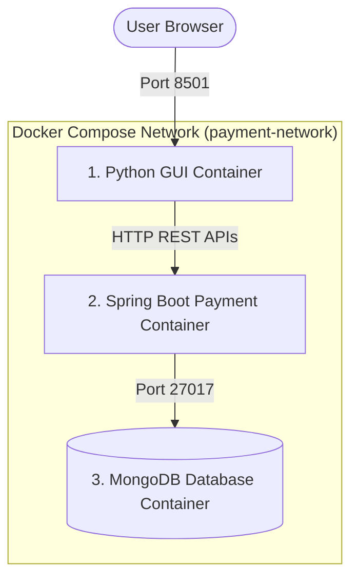

# DevOps Containerized Payment Application & Python GUI


A complete DevOps solution comprising a **Python-based GUI**, **Spring Boot Payment REST API Service**, and **MongoDB database**, orchestrated together as 3 Docker containers locally via Docker Compose and ready for Cloud Deployment (AWS / GCP / Azure / Kubernetes).

---

## 🏛️ System Architecture

The application runs as 3 interconnected Docker containers on a shared Docker network:



### 📦 Container Services

| Container Service | Image / Build | Internal Port | Host Port | Purpose |
| :--- | :--- | :--- | :--- | :--- |
| **`gui`** | `./gui/Dockerfile` (Python 3.11 + Streamlit) | `8501` | `8501` | Interactive dashboard for payments, system health & reports |
| **`app`** | `./Dockerfile` (Spring Boot JRE Alpine) | `8080` | `8080` | Core Payment REST API Service |
| **`mongo`** | `mongo:7` | `27017` | `27017` | Document Database storing payments and message logs |

---

## 🌟 Python GUI Features

Developed using Python and Streamlit, the GUI provides a user-friendly interface consuming all backend REST APIs:

1. **💳 Charge Payment**: Interactive form to process payments with real-time status output (`SUCCESS` / `FAILED`), transaction IDs, timestamps, and expandable raw JSON inspection.
2. **📊 Transaction History & Analytics**: Formatted tables, filter controls (by status and method), KPI metrics (Total Volume, Success Rate), and interactive Plotly distribution charts.
3. **🖥️ System Health Telemetry**: Live metrics for JVM memory usage, CPU load %, service uptime, and database record counters.
4. **💬 System Message Board**: View live system logs and post new messages directly to MongoDB.
5. **📁 Data Export**: One-click downloads for JSON database backups and CSV transaction spreadsheets.
6. **🛡️ Graceful Error Handling**: Fallback indicators when backend API is starting up or unreachable.

---

## 🚀 Phase 1: Local Deployment (Docker Compose)

### Prerequisites
- [Docker Desktop](https://www.docker.com/products/docker-desktop/) (includes Docker Compose)
- Git

### 1. Launch the 3-Container Stack

Clone the repository and run:

```bash
docker compose up --build -d
```

### 2. Verify Container Status

Check that all 3 containers are running:

```bash
docker compose ps
```

You should see:
- `payment-gui` (running on `0.0.0.0:8501`)
- `payment-backend` (running on `0.0.0.0:8080`)
- `payment-mongo` (running on `0.0.0.0:27017`)

### 3. Access Application Interfaces

- 🎨 **Python GUI App**: [http://localhost:8501](http://localhost:8501)
- ⚙️ **Payment REST API**: [http://localhost:8080/api/hello](http://localhost:8080/api/hello)
- 🍃 **MongoDB**: `localhost:27017`

### 4. Stopping the Stack

```bash
docker compose down
```

---

## 🌐 Phase 2: Cloud Deployment

The application can be deployed to any major cloud provider using Docker Compose or Kubernetes.

### Option A: Deployment on AWS EC2 / VM

1. **Provision EC2 Instance**:
   - OS: Ubuntu 22.04 LTS
   - Instance Type: `t3.medium` or `t2.micro`
   - Security Group Inbound Rules:
     - Port `22` (SSH)
     - Port `8501` (Python GUI)
     - Port `8080` (Spring Boot API - optional public access)

2. **Connect & Install Docker**:
   ```bash
   sudo apt-get update
   sudo apt-get install -y docker.io docker-compose-v2
   sudo usermod -aG docker ubuntu
   ```

3. **Deploy Application**:
   ```bash
   git clone <repository-url>
   cd Deployment
   docker compose -f docker-compose.prod.yml up --build -d
   ```

4. Access GUI via EC2 Public IP: `http://<EC2-PUBLIC-IP>:8501`

---

### Option B: Deployment on Kubernetes (AWS EKS / GCP GKE / Azure AKS / Minikube)

1. **Apply Manifests**:
   ```bash
   kubectl apply -f k8s/deployment.yaml
   ```

2. **Verify Pods & Services**:
   ```bash
   kubectl get pods -n payment-app
   kubectl get svc -n payment-app
   ```

3. **Access Public LoadBalancer**:
   ```bash
   kubectl get svc gui-service -n payment-app
   ```

---

## 🔌 API Endpoint Documentation

| Method | Endpoint | Description |
| :--- | :--- | :--- |
| `GET` | `/api/hello` | Service Health & DB Connection Check |
| `GET` | `/api/system-stats` | System Resource Usage & DB Record Counts |
| `POST` | `/api/payments/charge` | Process Payment (`sender`, `amount`, `method`) |
| `GET` | `/api/payments/history` | Retrieve Transaction History List |
| `GET` | `/api/messages` | Retrieve System Message Logs |
| `POST` | `/api/messages` | Store New System Message (`sender`, `text`) |
| `GET` | `/api/export/json` | Download Full Database Backup (JSON) |
| `GET` | `/api/export/excel` | Download Formatted Transactions Export (CSV) |

---

## 🧪 Postman Testing

A pre-configured Postman Collection is provided in the repository:
`Cloud_Deployment_Console.postman_collection.json`.

Import this file into Postman to test all endpoints independently.

---

## 📄 License

This project is licensed under the MIT License - see the [LICENSE](file:///wsl$/Ubuntu/home/mukul/Deployment/LICENSE) file for details.
